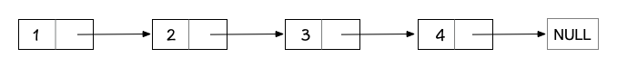
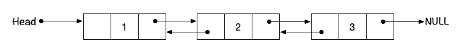
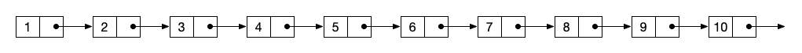
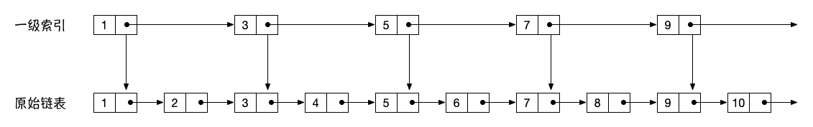
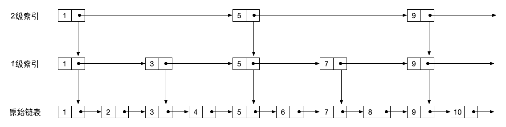
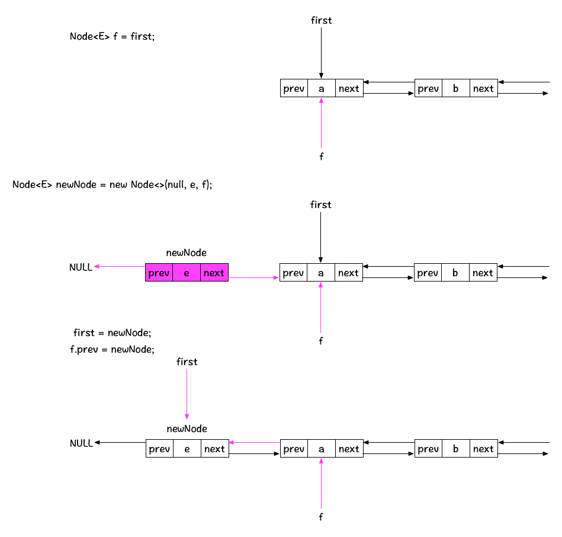
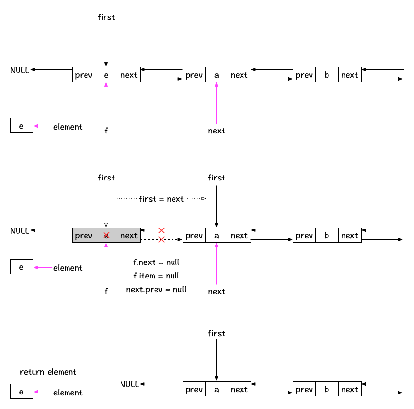
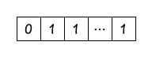

# 算法学习笔记-Week-1

## 数组

数组可能是我们日常工作中最常见一种数据结构，而且也是最为基础的数据结构，我认为要掌握这种数据结构
并不难，只需要记住数组的以下特点:

* **内存连续性**：数组的本质实际上是虚拟内存中开辟的连续存储空间，因此连续性是数组最核心的特点。
* **按下标(index)查找效率为O(1)**：数组下标从0~n，根据下标查找任意元素都是常数级的时间复杂度，因此按下标查找的效率高
* **插入/删除元素效率为O(n)**：由于要确保数组内存的连续性，在数组中新增/删除元素时，往往需要移动目标元素后面的所有元素，导致效率低下。

我觉得这里应该实际编写一下数组的插入/删除操作的代码，体会一下数组这种数据结构为什么不适合用于频繁
更新数据的应用场景。推荐详细阅读Java中ArrayList的源码，这是一个Java中标准的可变长度数组的实现。

另外在数组的特点之外，我觉得数组这种数据结构对于零散内存的利用率可能比较低效，假设某种场景下我需要
申请大小为1M的数组，但是却没有足够的连续内存，那么可能就会创建失败，但实际上系统中可能有超过1M的零散
内存可供使用。

## 链表

链表实际上是相对于数组的一种互补的数据结构，链表的特点和数组恰恰相反：

* **内存不连续**：链表是一种链式结构，各个元素之间通过指针互相连接，因此不要求内存的连续性，通过指针可以找到某个元素。
* **查找元素效率为O(n)**：对于普通的单链表结构，要查找某个节点的元素，那就需要从链表的head遍历到目标节点的前一个节点，
然后通过next指针找到目标元素，因此时间复杂度为O(n)
* **删除元素效率为O(1)**：相对数组删除元素的低效来说，链表在删除某个节点的元素时，只需要调整节点指针的指向即可，因此是常数级别的复杂度。

链表由于加入了指针，因此细分出了很多不同的结构

* 单向链表



* 双向链表



* 循环链表

其实这些不同类别的链表，我认为区别就在于指针的指向，多少，以及最终构成一个什么样的逻辑结构，真正
需要了解其实并不是这些结构的特点，而是每个结构适合用于解决哪些问题。

例如在本周练习的LeetCode-355-设计推特的题目中，就应用了单向链表来存储最近发送的推特，即每次把
最新发送的推特放在链表头部，这样如果要取出最近的10条推特，就从头部往后遍历10条即可，我认为这实际上
是简单的LRU cache的实现(当然可能过于简单了，但是思路应该是一致的)

## 跳表

本周的课程中讲到了跳表，跳表本质上是链表的一种扩展结构，通过给链表增加更多维度，来提升检索效率。

使用跳表的重要前提条件：**链表有序**

跳表是一种插入/删除/查找都是O(log n)的一种数据结构，对标于平衡二叉树，但相对于平衡二叉树来讲，
跳表优势在于原理简单，实现起来相对容易。

这里老师提到了一个算法思维：对于一维的数据结构，可以采用升维的方式来降低时间复杂度。
而这里的跳表实际上也是采用升维的方式，具体的跳表思路如下：

首先一个有序的链表如下：



第一步：建立1级索引(升维)



可以看到，在建立了1级索引之后，原来要查找某个元素所需的O(n)的复杂度被降低为O(n/2)，因为每隔
1个元素建立了一个索引，有点类似于二分查找的思想，那么依次类推，建立了2级索引之后，如下图：



在1级索引的基础之上，又将查找的复杂度降低了1/2，因此类推下去，最终查找的复杂度为O(log n)。

但是跳表这种数据结构我认为也有它的缺陷，当数据量很大的时候，建立索引的层级越多，需要占用的额外存储
空间也就越多，这样就涉及到如何权衡空间与效率的问题。 另外如果底层的原始链表会经常变化，新增或删除
元素都会导致索引的改变，如果变化频率过高，最终索引的位置可能并不理想，例如两个索引之间相隔的元素太多
会导致查询效率下降。

## 双端队列的Java源码剖析

在视频课的第4讲中，老师讲到了栈和队列以及双端队列这几种数据结构，另外还包括优先级队列。

Java中对于双端队列的接口定义是`java.util.Deque`，这个接口有多种不同的实现以应对不同的应用场
景，我这里只针对其中的两个实现来做分析，一个是基于**链表**实现的`LinkedList`，另一个是基于
**数组**实现的`ArrayDeque`，通过学习双端队列的两种不同的实现，来加强自己对队列这种数据结构的
理解。

### LinkedList实现分析

首先从LinkedList源码可以分析出，这个类本质上是一个双链表的数据结构，之所以说是双链表，从它对于
Node节点的定义可以分析出来：

```java
    private static class Node<E> {
        E item;
        Node<E> next;
        Node<E> prev;

        Node(Node<E> prev, E element, Node<E> next) {
            this.item = element;
            this.next = next;
            this.prev = prev;
        }
    }
```

每个Node维护着前驱节点的指针prev，以及后继节点的指针next，这不正是典型的双链表结构吗~

另外LinkedList中维护了链表的头尾节点first和last，因为双端队列需要对头尾节点进行插入和删除操作，
因此这里需要单独维护头尾节点。

```java
    /**
     * Pointer to first node.
     * Invariant: (first == null && last == null) ||
     *            (first.prev == null && first.item != null)
     */
    transient Node<E> first;

    /**
     * Pointer to last node.
     * Invariant: (first == null && last == null) ||
     *            (last.next == null && last.item != null)
     */
    transient Node<E> last;
```

说完基本结构之后，下面分析一下双端队列的几个核心的添加/删除/获取元素的接口。

首先看新增元素的接口`offerFirst()`,`addFirst()`，通过源码可以看到，`offerFirst()`的实现
是直接调用的`addFirst()`，那么这里直接看`addFirst()`的实现即可:

```java
    /**
     * Inserts the specified element at the beginning of this list.
     *
     * @param e the element to add
     */
    public void addFirst(E e) {
        linkFirst(e);
    }

    /**
     * Links e as first element.
     */
    private void linkFirst(E e) {
        final Node<E> f = first;
        final Node<E> newNode = new Node<>(null, e, f);
        first = newNode;
        if (f == null)
            last = newNode;
        else
            f.prev = newNode;
        size++;
        modCount++;
    }
```

这里可以看到，实际的实现逻辑在私有方法`linkFirst()`中，这里所做的操作实际上也很简单，就是以新
增的元素创建的节点为新的头节点，然后将原有的头节点作为新节点的next节点，下面画个图来清晰的理一
下这里的逻辑：



上面的图解忽略了判断f是否为null的情况，当链表没有元素的时候，首次加入的元素既是first，也是last。

由于`addLast()`,`offerLast()`逻辑大致相同，这里就不再重复了。

下面看一下删除元素的接口`removeFirst()`,`pollFirst()`，这两个方法的主要区别在于当first节点
为null时，`removeFirst()`会抛出`NullPointerException`，而`pollFirst()`会return一个null
值，这里我觉得实际的应用场景上可能`pollFirst()`的使用会更多一些，毕竟空指针这种异常对于调用方
并不是很友好。

那么下面主要看一下`pollFirst()`的实现，同理`pollLast()`实现类似，不再赘述：

```java
    /**
     * Retrieves and removes the first element of this list,
     * or returns {@code null} if this list is empty.
     *
     * @return the first element of this list, or {@code null} if
     *     this list is empty
     * @since 1.6
     */
    public E pollFirst() {
        final Node<E> f = first;
        return (f == null) ? null : unlinkFirst(f);
    }

    /**
     * Unlinks non-null first node f.
     */
    private E unlinkFirst(Node<E> f) {
        // assert f == first && f != null;
        final E element = f.item;
        final Node<E> next = f.next;
        f.item = null;
        f.next = null; // help GC
        first = next;
        if (next == null)
            last = null;
        else
            next.prev = null;
        size--;
        modCount++;
        return element;
    }
```

这里的操作实际上也比较直接，先暂存待删除的first指针元素和next引用，然后断开first指针和下一个
节点之间的引用，最后将next节点作为新的头节点，并将整体的size减少1个，图示如下：



### ArrayDeque实现分析

`ArrayDeque`这个类是`Deque`接口的数组实现，这里底层主要是应用了一个循环数组的结构，数组的实现
方式相对于链表实现来说要更高效，但是需要占用多余的内存来确保数组的循环结构，这里的实现相对于
`LinkedList`来说要稍微难以理解一些，主要是因为很多代码都包含位运算来保证环形结构，所以导致代码
看上去不是很直观。

在分析这部分源码的时候，在网上看到了一篇博客，感觉已经把`ArrayDeque`的内部实现细节讲解的非常清楚
了，所以这里附上博客链接

[剖析ArrayDeque](https://www.cnblogs.com/swiftma/p/6029547.html)

我这里只针某些难以理解的代码做一些解释：

```java
        elements[head = (head - 1) & (elements.length - 1)] = e;
        if (head == tail)
            doubleCapacity();
```

在`addFirst`,`addLast`操作中都有类似的代码，这里通过 (head - 1) 和 (elements.length - 1)
做 & 操作，来确定下一个正确的头/尾节点，为什么这里可以这样做呢？其实主要原因是因为`ArrayDeque`
的对底层数组的length做了限定：length必须是2的n次幂。

于是我们可以想象一下(elements.length - 1)这个表达式的二进制形式，一定是如下的样子：



那么(head - 1)与这样一个形式的二进制值做 & 操作之后，可以确保得到的值都在数组逻辑循环的正确位置，
这其实和取余数的运算得到的效果是一致的，但是要比普通的取余操作效率更高。

假设head为0，那么经过这个操作之后，head就是elements.length - 1，即最后一个元素。

再看看下面的代码：

```java
    private static int calculateSize(int numElements) {
        int initialCapacity = MIN_INITIAL_CAPACITY;
        // Find the best power of two to hold elements.
        // Tests "<=" because arrays aren't kept full.
        if (numElements >= initialCapacity) {
            initialCapacity = numElements;
            initialCapacity |= (initialCapacity >>>  1);
            initialCapacity |= (initialCapacity >>>  2);
            initialCapacity |= (initialCapacity >>>  4);
            initialCapacity |= (initialCapacity >>>  8);
            initialCapacity |= (initialCapacity >>> 16);
            initialCapacity++;

            if (initialCapacity < 0)   // Too many elements, must back off
                initialCapacity >>>= 1;// Good luck allocating 2 ^ 30 elements
        }
        return initialCapacity;
    }
```

这里的numElements是用户传入的初始元素个数，而返回值iniCapacity是实际初始化的数组容量，而这里
的位运算操作实际上是为了确保初始的容量一定是一个刚好大于 numElements 的 2的n次幂，例如
numElements = 10，那么initCapacity就是16, 如果numElements是16，那么initCapacity就是32，
以此类推。

## 算法练习总结

本周的算法题主要集中在数组，链表，以及栈和队列相关的题目，下面总结一下这周训练过程中获得的解题技巧，

### 技巧1：定义多个指针协助解题

141-环形链表，206-反转链表等题目实际上都可以通过引入多个指针，然后通过指针的移动控制元素的变化，
来达到解题目的，还有一些应用快慢指针的思路，个人觉得遇到链表的一些题目，大多都需要定义多个临时的
指针变量，来辅助各个节点在循环中的变化。

### 技巧2：干想不如画图

基本上每个算法题目，我都会在演算纸上面把每次循环后元素的变化画在纸上，来辅助自己理清楚思路，即使
有些题目并不是自己想出来的解法，也会把别人的解法理解了之后再自己思考一遍，这样基本上图画清楚之后，
写代码也就是水到渠成的事情了，尤其是链表相关的题目，由于代码理解起来比较晦涩，并不直观，所以必须
要把指针的变化画在纸上。

### 技巧3：找到子问题，巧用递归

其实链表的很多题目都可以通过递归的方式来解决，而递归的重点就在于如何找到子问题，比如爬楼梯问题中，
递归的方法就在于只关心最后1级台阶和最后两级台阶的走法，来假设子问题已经解决，那么只解决最后一步
就可以了，同理也适用于反转链表，假设head节点之后的所有节点都已经被正确反转了，那么就只需要考虑
如何反转head节点和已经反转之后的那个返回值节点之间如何反转就可以了。

### 技巧4：理解题意，关注边界

我认为很多算法题目其实解法并不难，难的在于深入的利用题目所给出的限定条件，这时就需要深刻理解题目，
就像老师课程中讲的，面试时要和面试官反复确认题目要求，确保理解题意；而另外一个重点就是关注各种边界
条件的处理，因为往往逻辑虽然是正确的，但也会由于边界条件没有仔细考虑，而导致某些corner case无法
通过。