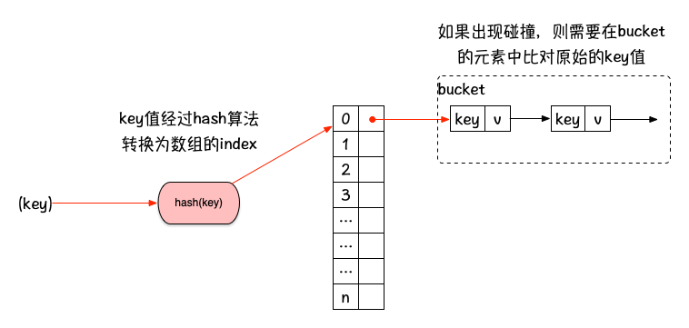
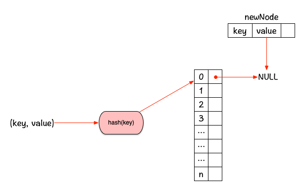
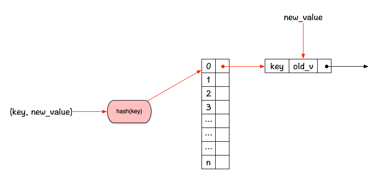
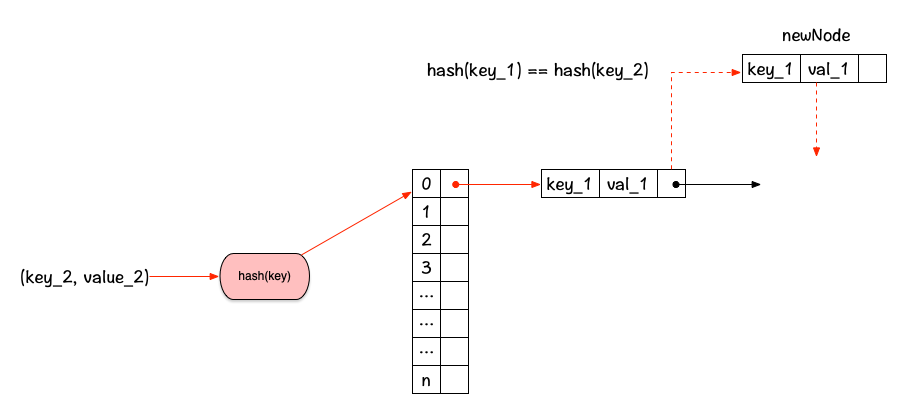
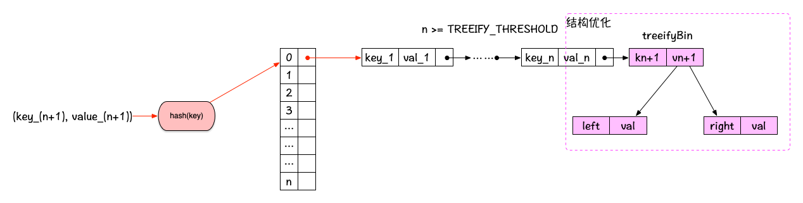

# 算法学习笔记-Week-2

## 关于哈希表及Java-HashMap源码分析

### 哈希表简介

在第5课中，讲到了哈希表这种数据结构，由于HashTable和HashSet的核心原理都一样，所以这里仅仅整理
一下哈希表这种数据结构的特点，并且分析一下Java中HashMap的源码实现，加强自己对于哈希表的理解。

首先我认为哈希表本质上是一种复合型的数据结构，因为从哈希表的实现上看，哈希表由3部分组成：

* 哈希函数：用哈希算法计算key的hash，定位元素的位置，降低各种操作的复杂度，哈希算法的精确与否
决定了哈希表发生哈希碰撞的概率，也就决定了哈希表的使用效率。
* 底层元素存储结构：其实哈希表本质上还是需要基础的数据结构来支撑，作为核心的存储结构，可以是数组，
也可以是链表，例如Java中的HashMap底层的核心存储就是用的数组，而LinkedHashMap底层就是用链表。
* bucket：之所以需要bucket，主要是为了解决[哈希碰撞问题](https://www.ruanyifeng.com/blog/2018/09/hash-collision-and-birthday-attack.html)的问题，这个bucket的数据结构可以是链表，也可以是
树，但是存在的意义是一样的。

理解了上面的3个组成部分之后，就不难想象出哈希表这种数据结构的内部机制了，这里用一张图来形象的说明
(这里为了方便起见，默认底层存储结构为数组，bucket为链表)：



关于哈希表这种数据结构这里就不再花费过多内容描述了，下面分析一下Java对于哈希表的工业级实现。

### 剖析Java-HashMap源码

HashMap相信对于Javaer们来说都不陌生，虽然日常中对于HashMap的使用可能已经烂熟于心了，但是对于
内部的实现细节，相信可能很多人都没有深究过，包括我自己也是，所以借着本次学习哈希表这种数据结构的
机会，详细理解一下。

首先从构造方法入手，看一下`HashMap`的几个主要`fields`：

```java
    /**
     * Constructs an empty <tt>HashMap</tt> with the specified initial
     * capacity and load factor.
     *
     * @param  initialCapacity the initial capacity
     * @param  loadFactor      the load factor
     * @throws IllegalArgumentException if the initial capacity is negative
     *         or the load factor is nonpositive
     */
    public HashMap(int initialCapacity, float loadFactor) {
        if (initialCapacity < 0)
            throw new IllegalArgumentException("Illegal initial capacity: " +
                                               initialCapacity);
        if (initialCapacity > MAXIMUM_CAPACITY)
            initialCapacity = MAXIMUM_CAPACITY;
        if (loadFactor <= 0 || Float.isNaN(loadFactor))
            throw new IllegalArgumentException("Illegal load factor: " +
                                               loadFactor);
        this.loadFactor = loadFactor;
        this.threshold = tableSizeFor(initialCapacity);
    }
```

这里我们看到`HashMap`在创建时可以指定两个参数，`initialCapacity`和`loadFactor`，第一个参数
其实比较好理解，就是初始的容量，而第二个参数的作用实际上在`HashMap`的[javadoc](https://docs.oracle.com/javase/10/docs/api/java/util/HashMap.html)中有说明，这里截取如下：

> The load factor is a measure of how full the hash table is allowed to get before its capacity is automatically increased. When the number of entries in the hash table exceeds the product of the load factor and the current capacity, the hash table is rehashed (that is, internal data structures are rebuilt) so that the hash table has approximately twice the number of buckets.

根据Javadoc的描述可以了解到，当哈希表存储的entries超过了 `loadFactor` * `capacity` 时，那么
底层存储元素的数组就会进行扩容操作，以提供足够的存储空间来存放未来可能添加的更多元素，在哈希表中，
这种扩容操作叫做rehash，因为当底层数组扩容之后，所有元素都需要重新计算hash值，尽量保证不和之后加入
的元素产生哈希碰撞，所以这个过程是非常耗时的操作。

了解了这两个参数的意义之后，我觉得如果后面在实际业务中创建`HashMap`对象的时候，还是尽量不要使用
`Map map = new HashMap()` 这种方式了，至少应该思考一下：在这个业务场景下，map中存储元素的上
限是多少？

下面再看一下`HashMap`底层存储元素的核心数据结构，以及bucket的结构

```java
    /**
     * The table, initialized on first use, and resized as
     * necessary. When allocated, length is always a power of two.
     * (We also tolerate length zero in some operations to allow
     * bootstrapping mechanics that are currently not needed.)
     */
    transient Node<K,V>[] table;

        /**
     * Basic hash bin node, used for most entries.  (See below for
     * TreeNode subclass, and in LinkedHashMap for its Entry subclass.)
     */
    static class Node<K,V> implements Map.Entry<K,V> {
        final int hash;
        final K key;
        V value;
        Node<K,V> next;

        Node(int hash, K key, V value, Node<K,V> next) {
            this.hash = hash;
            this.key = key;
            this.value = value;
            this.next = next;
        }

        public final K getKey()        { return key; }
        public final V getValue()      { return value; }
        public final String toString() { return key + "=" + value; }

        public final int hashCode() {
            return Objects.hashCode(key) ^ Objects.hashCode(value);
        }

        public final V setValue(V newValue) {
            V oldValue = value;
            value = newValue;
            return oldValue;
        }

        public final boolean equals(Object o) {
            if (o == this)
                return true;
            if (o instanceof Map.Entry) {
                Map.Entry<?,?> e = (Map.Entry<?,?>)o;
                if (Objects.equals(key, e.getKey()) &&
                    Objects.equals(value, e.getValue()))
                    return true;
            }
            return false;
        }
    }
```

这里可以看到，`table`这个变量实际上就是一个数组，而数组中存储的元素其实就是链表的节点，这个结构
实际上和我上面所画的图是一致的，只是`HashMap`在具体实现的时候，为了优化发生碰撞后的效率，这个
Node的结构实际上是会发生改变的，这个需要到具体的代码再进行说明。

说完`HashMap`的基本`fields`和基础结构，下面看一下常见操作的具体实现。

其实对于`HashMap`来说，最主要的操作就是存和取，也就是`put()`和`get()`,因此这里只针对这两个
操作来详细的分析，其他操作后面有时间再去详细理解。

#### get()

先上`get()`的代码

```java
    /**
     * Returns the value to which the specified key is mapped,
     * or {@code null} if this map contains no mapping for the key.
     *
     * <p>More formally, if this map contains a mapping from a key
     * {@code k} to a value {@code v} such that {@code (key==null ? k==null :
     * key.equals(k))}, then this method returns {@code v}; otherwise
     * it returns {@code null}.  (There can be at most one such mapping.)
     *
     * <p>A return value of {@code null} does not <i>necessarily</i>
     * indicate that the map contains no mapping for the key; it's also
     * possible that the map explicitly maps the key to {@code null}.
     * The {@link #containsKey containsKey} operation may be used to
     * distinguish these two cases.
     *
     * @see #put(Object, Object)
     */
    public V get(Object key) {
        Node<K,V> e;
        return (e = getNode(hash(key), key)) == null ? null : e.value;
    }

    /**
     * Implements Map.get and related methods
     *
     * @param hash hash for key
     * @param key the key
     * @return the node, or null if none
     */
    final Node<K,V> getNode(int hash, Object key) {
        Node<K,V>[] tab; Node<K,V> first, e; int n; K k;
        if ((tab = table) != null && (n = tab.length) > 0 &&
            (first = tab[(n - 1) & hash]) != null) {
            if (first.hash == hash && // always check first node
                ((k = first.key) == key || (key != null && key.equals(k))))
                return first;
            if ((e = first.next) != null) {
                if (first instanceof TreeNode)
                    return ((TreeNode<K,V>)first).getTreeNode(hash, key);
                do {
                    if (e.hash == hash &&
                        ((k = e.key) == key || (key != null && key.equals(k))))
                        return e;
                } while ((e = e.next) != null);
            }
        }
        return null;
    }
```

从代码中可以看到，主要的逻辑都集中在`getNode`方法中，而这个方法主要处理了下面两种情况：

1. 通过hash值能够直接定位唯一的元素(也就是bucket链表中只有1个元素，不存在碰撞)，那么直接返回
这个元素即可
2. bucket链表中存在多个元素，那么需要依次对比各个节点的key值，找到目标节点，然后返回元素

我这里先不讲解下面这段代码，留到put操作中去一起讲解：

```java
    if (first instanceof TreeNode)
        return ((TreeNode<K,V>)first).getTreeNode(hash, key);
```

第一种情况对应的代码如下：
```java
if (first.hash == hash && // always check first node
    ((k = first.key) == key || (key != null && key.equals(k))))
    return first;
```

这里其实做了3个比较：
1. hash值：第一个节点的hash和待查找的元素的hash值相等
2. 第一个节点的key和目标的key引用相同
3. 第一个节点的key和目标的key通过equals比较后也相同(也就是引用和值都相等)

经过这3个比较后，就能够确认这个节点就是目标节点，返回即可。

第二种情况对应的代码稍微复杂一点(删除了暂时不讲的代码)：
```java
if ((e = first.next) != null) {
    do {
        if (e.hash == hash &&
            ((k = e.key) == key || (key != null && key.equals(k))))
            return e;
    } while ((e = e.next) != null);
}
```

你会发现这里的逻辑其实和上面第一种情况的逻辑相似，就是从第二个节点开始循环去查找目标节点，这里不
再赘述。

#### put()

讲完get操作之后，我们看一下put操作，还是先上代码：

```java
    /**
     * Associates the specified value with the specified key in this map.
     * If the map previously contained a mapping for the key, the old
     * value is replaced.
     *
     * @param key key with which the specified value is to be associated
     * @param value value to be associated with the specified key
     * @return the previous value associated with <tt>key</tt>, or
     *         <tt>null</tt> if there was no mapping for <tt>key</tt>.
     *         (A <tt>null</tt> return can also indicate that the map
     *         previously associated <tt>null</tt> with <tt>key</tt>.)
     */
    public V put(K key, V value) {
        return putVal(hash(key), key, value, false, true);
    }

    /**
     * Implements Map.put and related methods
     *
     * @param hash hash for key
     * @param key the key
     * @param value the value to put
     * @param onlyIfAbsent if true, don't change existing value
     * @param evict if false, the table is in creation mode.
     * @return previous value, or null if none
     */
    final V putVal(int hash, K key, V value, boolean onlyIfAbsent,
                   boolean evict) {
        Node<K,V>[] tab; Node<K,V> p; int n, i;
        if ((tab = table) == null || (n = tab.length) == 0)
            n = (tab = resize()).length;
        if ((p = tab[i = (n - 1) & hash]) == null)
            tab[i] = newNode(hash, key, value, null);
        else {
            Node<K,V> e; K k;
            if (p.hash == hash &&
                ((k = p.key) == key || (key != null && key.equals(k))))
                e = p;
            else if (p instanceof TreeNode)
                e = ((TreeNode<K,V>)p).putTreeVal(this, tab, hash, key, value);
            else {
                for (int binCount = 0; ; ++binCount) {
                    if ((e = p.next) == null) {
                        p.next = newNode(hash, key, value, null);
                        if (binCount >= TREEIFY_THRESHOLD - 1) // -1 for 1st
                            treeifyBin(tab, hash);
                        break;
                    }
                    if (e.hash == hash &&
                        ((k = e.key) == key || (key != null && key.equals(k))))
                        break;
                    p = e;
                }
            }
            if (e != null) { // existing mapping for key
                V oldValue = e.value;
                if (!onlyIfAbsent || oldValue == null)
                    e.value = value;
                afterNodeAccess(e);
                return oldValue;
            }
        }
        ++modCount;
        if (++size > threshold)
            resize();
        afterNodeInsertion(evict);
        return null;
    }
```

这里的代码就比`get()`要复杂很多，核心的逻辑都在`putVal`这个方法中，乍一看感觉代码非常复杂，
if else 满天飞，很头疼。但是经过我仔细思考后发现，其实只需要想清楚下面的4种情况，就很容易理解
这段代码了：

1. 最常见的情况：没有hash碰撞，且目标位置之前没有元素，那么直接添加即可，画图解释如下：



2. 根据key更新value：之前已经存在的元素，根据key值更新value，图解如下：



3. 普通情况下的hash冲突：hash冲突次数不多，bucket链表长度不大的情况，需要查找到链表中正确的插入
位置，然后插入元素：



4. 特殊情况下的hash冲突：随着冲突次数增多，bucket长度持续增加，查询这个bucket下元素的效率降低，
这时需要改变bucket的存储结构来提高查询效率：



针对情况1，我们再来分解一下上面的代码，如下：

```java
if ((p = tab[i = (n - 1) & hash]) == null)
    tab[i] = newNode(hash, key, value, null);
```

就是这么简单的逻辑，这里的 `i = (n - 1) & hash` 实际上就通过取模操作找元素在map数组中对应的位置
(这里如果读过ArrayDeque的代码就很好理解)。这里其实就是第一种情况`tab[i] == null`，那么就直接
`tab[i] = newNode`。

情况2代码分解如下：
```java
if (p.hash == hash &&
    ((k = p.key) == key || (key != null && key.equals(k))))
    e = p;
// 省略部分代码
else {
    for (int binCount = 0; ; ++binCount) {
        if ((e = p.next) == null) {// 省略部分代码
        }
        if (e.hash == hash &&
            ((k = e.key) == key || (key != null && key.equals(k))))
            break;
        p = e;
    }
}
... ...
if (e != null) { // existing mapping for key
    V oldValue = e.value;
    if (!onlyIfAbsent || oldValue == null)
        e.value = value;
    afterNodeAccess(e);
    return oldValue;
}
```

上面的`afterNodeAccess`是`LinkedHashMap`提供的扩展点，这里暂时忽略。这里可以发现和`get`操作
里面查找元素的判断逻辑是一样的，都是判断目标节点的key和入参中的key是否一致，一致则证明是更新操作，
只是这里有2种情况：
1. 第一个节点就是要更新的目标节点
2. 需要从第二个节点开始查找更新的节点

因此这里就出现了两次 `if (e.hash == hash && ((k = e.key) == key || (key != null && key.equals(k))))`

由于put操作中无论是哈希碰撞，还是更新value，都需要做替换value值的操作，所以做为公共代码放在最下面。

对于情况3，如果出现了hash冲突而非更新节点，那么就要查找新的entry应该插入哪个位置，就是下面这段
代码所做的事情：
```java
for (int binCount = 0; ; ++binCount) {
    if ((e = p.next) == null) {
        p.next = newNode(hash, key, value, null);
        break;
    }
    p = e;
}
```

可以看到，删减了部分代码之后，这个逻辑就很清晰了，就是循环查找链表的结尾，然后将新的节点添加上去。

对于情况4，这里就需要补充之前get部分略过的内容了，`HashMap`中如果bucket链表的长度超过了常量值
TREEIFY_THRESHOLD，那么接下来的节点就会以红黑树的方式存储，以提升效率，相关的代码有以下几部分：

```java
// 如果要key对应的节点已经是TreeNode了，那么证明这个bucket的数据结构已经改变，则直接调用其他API
else if (p instanceof TreeNode)
    e = ((TreeNode<K,V>)p).putTreeVal(this, tab, hash, key, value);

for (int binCount = 0; ; ++binCount) {
    if ((e = p.next) == null) {
        p.next = newNode(hash, key, value, null);
        // 如果达到了TREEIFY_THRESHOLD 的值，那么就从hash值对应的节点开始改变数据结构
        if (binCount >= TREEIFY_THRESHOLD - 1) // -1 for 1st
            treeifyBin(tab, hash);
        break;
    }
}
```

上面在注释中做出了解释，至于`putTreeVal`和`treeifyBin`的逻辑这里就不展开了，是在是因为水平有限，
没看懂~~~等将来有时间再研究吧。。。。

P.S: 我发现**看懂了**跟**写出来**真的是两码事，写这个分析文档花费了多半天的时间，但看懂那一部分
代码，实际上才花费了不到半小时。。。。


## 哈希表的变通应用

在刷题过程中，发现哈希表在某些情况下可以用数组来代替以提高效率，例如242-有效字母异位词，299-猜
数字游戏，这两道题的解法中都用到了相同的思路，那就是用数组的下标作为key值，来存储一些有限的数据，
例如字母总共有26个，如果不区分大小写的话，刚好用一个长度为26的数组下标来表示；同理每位数字只能是
0~9其中一个，那就可以用一个长度为10的数组来表示，所以说数组和哈希表的区别其实就在于一个是通过index
查找元素，另一个是通过更复杂的key值查找元素。

## 242&49刷题笔记-重构题解过程

这里说一下下面的两个题目
1. [242-valid-anagram](https://leetcode-cn.com/problems/valid-anagram/description/)
2. [49-group-anagrams](https://leetcode-cn.com/problems/group-anagrams/)

这两个题目是有前后联系的，在做这两个题目的时候，我对自己的代码进行反复的重构之后，发现自顶向下的
编程方式以及可读性的重要性，下面总结一下重构的过程，以做记录。

首先看第一个题目：有效的字母异位词，这里就不对题目进行描述了，直接上官方的两种题解：

```java
public boolean isAnagram(String s, String t) {
    if (s.length() != t.length()) {
        return false;
    }
    char[] str1 = s.toCharArray();
    char[] str2 = t.toCharArray();
    Arrays.sort(str1);
    Arrays.sort(str2);
    return Arrays.equals(str1, str2);
}
```

这个题解的思路也很简单，就是先排序，再比较。

还有下面另外一种解法：

```java
public boolean isAnagram(String s, String t) {
    if (s.length() != t.length()) {
        return false;
    }
    int[] counter = new int[26];
    for (int i = 0; i < s.length(); i++) {
        counter[s.charAt(i) - 'a']++;
        counter[t.charAt(i) - 'a']--;
    }
    for (int count : counter) {
        if (count != 0) {
            return false;
        }
    }
    return true;
}
```

这种解法的思路在于用一个长度为26的数组作为哈希表，来存储每个字符出现的次数，在s中出现一次就+1，
在t中出现一次就-1，最后检查数组中是否有不为0的值。

这两种题解，我都根据自顶向下的编程思路，做出了重构，虽然核心的思路是一样的，但是我觉得这种编码
方式要更偏向于工程代码应有的样子。

下面是解法1重构后的代码：

```java
class Solution {
    public boolean isAnagram(String s, String t) {
        return resort(s).equals(resort(t));
    }

    private String resort(String s) {
        if (s == null) return "";
        if (s.length() < 2) return s;

        char[] s_arr = s.toCharArray();
        Arrays.sort(s_arr);
        return String.valueOf(s_arr);
    }
}
```

可以看到我抽取出了一个方法`resort`来对字符串进行转换，然后主逻辑用一行代码解决，这样在读起来的
时候，一眼就能知道思路，根本不需要过多的语言解释，而resort方法的实现也考虑了字符串为null或""的
情况，以及只有1个字符的情况，更重要的是，这个resort方法可以被直接复用到第49题中。

下面是解法2的重构：

```java
class Solution {
    public boolean isAnagram(String s, String t) {
        if (s == null || t == null || s.length() != t.length()) {
            return false;
        }
        
        int[] letters_cnt = countLetters(s, t, s.length());
        return checkLettersCnt(letters_cnt);
    }

    private int[] countLetters(String s, String t, int length) {
        int[] letters_cnt = new int[26];
        for (int i = 0; i < length; i++) {
            letters_cnt[s.charAt(i) - 'a'] += 1;
            letters_cnt[t.charAt(i) - 'a'] -= 1;
        }
        return letters_cnt;
    }

    private boolean checkLettersCnt(int[] letters_cnt) {
        for (int letter_count : letters_cnt) {
            if (letter_count != 0) return false;
        }
        return true;
    }
}
```

这里重构后思路也一目了然，首先是统计字母出现的次数并存储到数组中，即`countLetters`，然后检查
数组中的值是否都为0，也就是`checkLettersCnt`

下面再说一下第二个题目的解法，

```java
class Solution {
    public List<List<String>> groupAnagrams(String[] strs) {
        if (strs == null || strs.length == 0) {
            throw new IllegalArgumentException("Input list of string can't be empty!");
        }

        Map<String, List<String>> result = new HashMap<>(strs.length);
        for (String word : strs) {
            String key = resort(word);
            if (result.containsKey(key)) {
                result.get(key).add(word);
            } else {
                List<String> anagrams = new ArrayList<>();
                anagrams.add(word);
                result.put(key, anagrams);
            }
        }
        return new ArrayList<>(result.values());
    }
}
```

可以看到上面的解法依赖于之前重构出的`resort`方法，并且借住了一个hashmap来存储中间结果，这里会
发现如果没有之前重构出的`resort`方法，那么就需要自己再编写一些和之前题解重复的代码逻辑，在工程
中这样的重复代码实际上会增加维护成本，还是应该尽量避免。