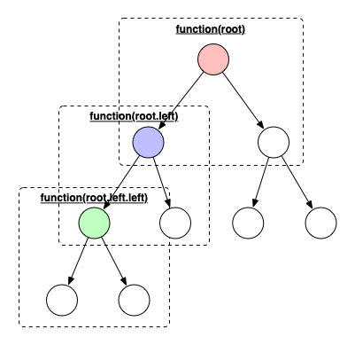
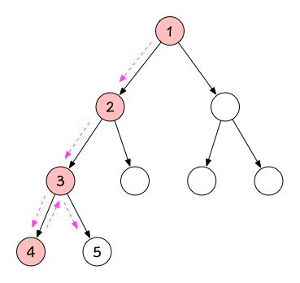
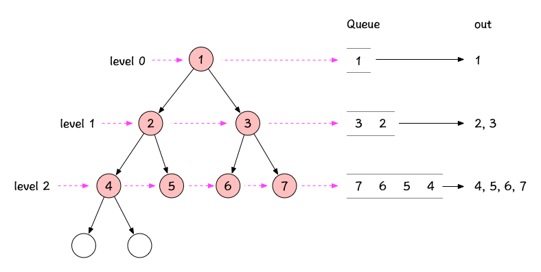

# 算法学习笔记-Week-4

## 深度优先和广度优先

个人觉得深度优先和广度优先的知识，实际上在学习二叉树相关的算法时已经多次接触到了，所以我觉得之所
以要单独拿出来说这两部分内容，是因为理解了这两种算法的思维之后，能够有助于我们形成一种解题**套路**，
而这种套路恰好是我们学习算法真正需要掌握的东西，下面分别来说一下个人对于这两种搜索方式的理解。

### 深度优先搜索

首先，要理解DFS，我觉得有几个前置概念(或者叫前置套路)需要理解，也就是：

1. 递归
2. 树结构
3. 二叉树的前中后序遍历

我觉得如果深刻理解了上面的3个概念，要理解深度优先搜索的解题思路就很容易了，首先很多二叉树结构的
问题都要用**递归**的方式来解决，因为递归方式解决树结构的问题具备天然的优势，我们可以看一下下面
的图：



从上面的图中可以看到，当我们要对树的每个节点都做一些操作时(例如遍历，查找...)，只需要对根节点
执行某个函数操作，然后递归的对根节点的子节点执行同样的函数操作，那么最终就会执行完所有节点，因此
对于DFS的两个很重要的点**递归**，**树结构**就不难理解了。

而所谓的DFS是为了查找某个符合要求的结果，既然要查找，那就免不了要进行遍历，这就涉及到了二叉树的
前中后序遍历，不管是哪种遍历，只要最终能够找到符合要求的节点，那么就符合DFS的思想，回想一下我们
在做二叉树的前中后序遍历时，最终都要从根节点遍历到某个子树的叶子节点，就像下面的图中所示



其实深度优先搜索的理论性知识理解起来并不难，关键还是要掌握如何解决深度优先相关的题目，下面先上
深度优先的代码模板：

```python
visited = set() 

def dfs(node, visited):
    if node in visited: # terminator
    	# already visited 
    	return 

	visited.add(node) 

	# process current node here. 
	...
	for next_node in node.children(): 
		if next_node not in visited: 
			dfs(next_node, visited)
```

根据代码模板可以看出，这其实就和二叉树的前序遍历是一样的

下面拿一个题目来深入理解一下深度优先搜索。

#### [559.N叉树的最大深度](https://leetcode-cn.com/problems/maximum-depth-of-n-ary-tree/)

这道题的解法其实很直观，我们直接应用代码模板即可：

```python
def dfs(root):
    if root is None:
        return 0

    res = 1
    for child in root.children:
        res = max(res, dfs(child) + 1)
    return res
```

### 广度优先搜索

从理论上讲，BFS理解起来也很容易，相对于DFS的纵向搜索，BFS是横向的来检索元素，但是由于从树的结构
上来讲不适合横向的遍历，所以广度优先搜索需要引入额外的数据结构来辅助搜索，这个数据结构就是队列，
我们还是画个图来辅助理解：



从上面图中可以看到，所谓广度优先搜索本质上就是树的层序遍历，我们从根节点开始，将每个level的节点
依次放入队列，由于队列数据结构的特点是先进先出，所以当每个level的节点依次出队时，就实现了按层次
的遍历，也就是广度优先搜索。

由于老师给出的广度优先搜索代码模板个人感觉理解起来比较困难，所以我这里给出我在网络上面看到的一个
代码模板：

```python
# 计算从起点 start 到终点 target 的最近距离
int BFS(Node start, Node target) {
    Queue<Node> q; // 核心数据结构
    Set<Node> visited; // 避免走回头路

    q.offer(start); // 将起点加入队列
    visited.add(start);
    int step = 0; // 记录扩散的步数

    while (q not empty) {
        int sz = q.size();
        /* 将当前队列中的所有节点向四周扩散 */
        for (int i = 0; i < sz; i++) {
            Node cur = q.poll();
            /* 划重点：这里判断是否到达终点 */
            if (cur is target)
                return step;
            /* 将 cur 的相邻节点加入队列 */
            for (Node x : cur.adj())
                if (x not in visited) {
                    q.offer(x);
                    visited.add(x);
                }
        }
        /* 划重点：更新步数在这里 */
        step++;
    }
}
```

同样，下面拿一个题目来应用一下代码模板：

#### [111-二叉树最小深度](https://leetcode-cn.com/problems/minimum-depth-of-binary-tree/submissions/)

直接应用上面的代码模板：

```python
# Definition for a binary tree node.
# class TreeNode(object):
#     def __init__(self, x):
#         self.val = x
#         self.left = None
#         self.right = None

class Solution(object):
    def minDepth(self, root):
        """
        :type root: TreeNode
        :rtype: int
        """
        if root is None:
            return 0
        
        queue = [root]
        depth = 1
        while queue:
            size = len(queue)
            for i in range(size):
                node = queue.pop(0)
                if not node.left and not node.right:
                    return depth
                if node.left:
                    queue.append(node.left)
                if node.right:
                    queue.append(node.right)
            depth += 1
        return depth
```

这里由于不存在重复访问，所以不需要visited来记录重复节点

### DFS和BFS小结

其实在看到DFS相关的题目时，感觉和回溯相关的题目类似，所以我认为很多需要按深度递归的题目都适用于
DFS的套路，而BFS更适用于找最短路径的问题，因为BFS是按层搜索。

另外DFS一般用递归的方式，而BFS引入了额外的数据结构来辅助算法，所以从空间复杂度上来讲，DFS要优于
BFS

形象比喻：DFS是一条线，BFS是一个面，DFS是一杆子查到底，BFS是层层剥皮

## 贪心算法

说实在的，我目前对于贪心算法的思路还并不是很清晰，做了几个贪心算法的题目之后，感觉并不知道为什么
这种解法就是贪心算法，所以这里的笔记暂时以分析题目为主，就不对贪心算法的理论和理解做解释了。

### [455-分发饼干](https://leetcode-cn.com/problems/assign-cookies/)

题解：
```python
class Solution(object):
    def findContentChildren(self, g, s):
        """
        :type g: List[int]
        :type s: List[int]
        :rtype: int
        """
        g.sort()
        s.sort()
        gi, si = 0, 0
        while gi < len(g) and si < len(s):
            if g[gi] <= s[si]:
                gi += 1
            si += 1
        return gi
```

贪心思路：局部最优解能够推出全局最优解，在本题中，全局最优解就是尽量多的满足更多孩子的胃口，而局
部最优解就是优先满足胃口小的孩子，当所有胃口小的孩子都分配完饼干之后，那就是能够满足的最多孩子的
数量，这个思路其实也很明显。

所以最终的解法就是，先对两个数组进行排序，然后定义两个指针分别指向数组头节点进行遍历，如果当前的
孩子胃口可以被满足，那么结果+1，否则就继续判断下一个饼干是否能满足当前的孩子，当所有饼干都被分配
后，得到最终结果。

### [122-买卖股票的最佳时机II](https://leetcode-cn.com/problems/best-time-to-buy-and-sell-stock-ii/)

题解：
```python
class Solution(object):
    def maxProfit(self, prices):
        """
        :type prices: List[int]
        :rtype: int
        """
        profit = 0
        for i, price in enumerate(prices):
            if i < len(prices) - 1:
                sub = prices[i + 1] - price
                if sub > 0:
                    profit += sub
        return profit
```

贪心思路：全局最优解就是获得最大的利润，而局部最优解就是不错过每一个股票涨的节点，只要每次都在涨
之前买入，涨之后卖出，就能够赚取所有的利润，那么最终的利润也会最大。

### 小结

通过上面两个贪心算法的题目，再结合老师的讲解，我感觉能够应用贪心算法的题目，主要是确定局部最优解
能够导出全局最优解。

## 二分查找